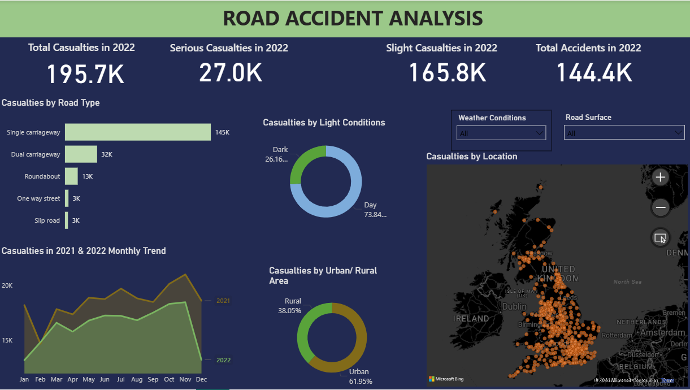

# 🚗 Road Accident Analysis Dashboard


---

## 📌 Project Overview

This project presents an interactive **Road Accident Analysis Dashboard** developed using **Microsoft Power BI**. The dashboard transforms raw road accident data into meaningful visual insights, enabling users to analyze accident trends, casualty statistics, vehicle involvement, road conditions, and geographical patterns.

The dashboard is designed to support data-driven decision-making for traffic authorities, policymakers, and researchers.

---

## 🎯 Objectives

- Analyze road accident trends.
- Identify high-risk locations and conditions.
- Visualize casualty statistics.
- Monitor accident severity.
- Understand vehicle-type involvement.
- Provide interactive filtering for better analysis.

---

## 🛠 Tools & Technologies

- Microsoft Power BI
- Microsoft Excel
- Data Visualization
- Data Cleaning
- Power Query
- DAX

---

## 📂 Repository Structure

```text
Road-Accident-Analysis-Dashboard/
│
├── README.md
├── LICENSE
├── Dashboard.png
├── Road Accident Analysis Dashboard.pbix
└── Excel Data Link
```

---

# 📊 Dashboard Features

The dashboard provides insights into:

- Total Accidents
- Total Casualties
- Fatal Casualties
- Serious Casualties
- Slight Casualties
- Monthly Accident Trends
- Vehicle Type Analysis
- Road Surface Analysis
- Road Type Analysis
- Weather Conditions
- Urban vs Rural Accidents
- Day vs Night Analysis
- Location-based Insights

---

# 📸 Dashboard Preview

> Dashboard screenshot



---

# 🚀 Workflow

### 1. Data Collection

Road accident data collected in Excel format.

↓

### 2. Data Cleaning

- Removed duplicates
- Corrected missing values
- Standardized columns

↓

### 3. Data Transformation

Performed using **Power Query**.

↓

### 4. Data Modeling

Created relationships and calculated measures using **DAX**.

↓

### 5. Dashboard Development

Designed interactive reports and KPIs in Power BI.

↓

### 6. Analysis

Generated insights for accident patterns and trends.

---

# 📈 Key Insights

The dashboard helps answer questions such as:

- Which month recorded the highest number of accidents?
- Which vehicle types are most involved?
- Which road conditions contribute to more accidents?
- What percentage of accidents occur in urban areas?
- How do weather conditions affect accidents?
- Which accident severity category is most common?

---

# 📊 Interactive Filters

Users can filter the dashboard by:

- Year
- Month
- Road Type
- Weather Condition
- Vehicle Type
- Accident Severity
- Urban/Rural Area
- Light Condition

---

# 📖 Learning Outcomes

Through this project, I gained experience in:

- Power BI Dashboard Development
- Data Cleaning
- Power Query
- DAX Calculations
- Data Modeling
- Business Intelligence
- Interactive Reporting
- Data Visualization Best Practices

---

# 📁 Files Included

| File | Description |
|------|-------------|
| Road Accident Analysis Dashboard.pbix | Power BI Dashboard |
| Dashboard.png | Dashboard Preview |
| Excel Data Link | Source Data |
| README.md | Project Documentation |

---

# 💡 Future Improvements

- Real-time data integration
- Predictive accident analysis
- Machine Learning forecasting
- GIS Mapping
- Drill-through reports
- Mobile dashboard optimization

---

# 👨‍💻 Author

## Saubhagya Munsi

**AI & Machine Learning | Data Analytics | Power BI | Python | SQL**

GitHub: https://github.com/Saubhagya-M

---

# ⭐ If you found this project useful, don't forget to Star the repository!

---

# 📜 License

This project is licensed under the **MIT License**.

© 2026 Saubhagya Munsi
